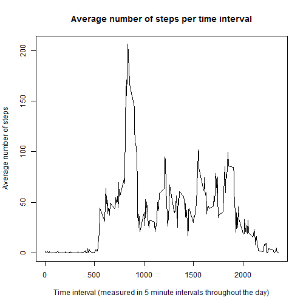

This is a project being done for the Reproducible Research class offered as part of the Data Science Specialization offered by Johns Hopkins and Coursera.

Directions from the assignment are represented in italics.

Project uses the following packages:
plyr
ggplot2
lattice

###Loading and preprocessing the data

#####*[Directions] Load the data from the CSV file.*


```r
activity <- read.csv("./data/activity.csv")
```

#####*[Directions] Process/transform the data (if necessary) into a format suitable for your analysis.*

Convert date variable from factor to date. Utilizes functions from the lubridate package.


```r
activity$date <- as.Date(activity$date, format = "%Y-%m-%d")
```

###What is mean total number of steps taken per day?

#####*[Directions] Create a histogram showing the total number of steps recorded each day.*

Data manipulation uses plyr package and graphing uses ggplot2 package.


```r
library(plyr)
library(ggplot2)
dailysteps <- ddply(activity, .(date), summarize, steps = sum(steps))
g <- ggplot(dailysteps, aes(steps))
g <- g + geom_histogram(colour = "white", binwidth = 1250)
g <- g + labs(x = "Number of steps taken in a day")
g <- g + labs(y = "Number of days")
g <- g + labs(title = "Steps taken per day")
g <- g + theme(plot.title = element_text(face = "bold"))
g <- g + scale_y_continuous(breaks = seq(0,14,2))
g
```

 

#####*[Directions] Calculate and report the mean and median total number of steps taken per day.*

Any days with NA for steps taken are ignored in this section of the analysis.


```r
mean <- as.integer(mean(dailysteps$steps, na.rm = TRUE))
median <- as.integer(median(dailysteps$steps, na.rm = TRUE))
```
The mean number of steps in a day is 10766.

The median number of steps in a day is 10765.

###What is the average daily activity pattern?

#####*[Directions] Make a time series plot (i.e. type = "1") of the 5-minute interval (x-axis) and the average number of steps taken, averaged across all days (y-axis).*

Data manipulation uses plyr package (loaded in a previous section) and graphing uses the base plotting system. The daily averages are taken across the 61 days of the data set. NA values are excluded.


```r
intervalsteps <- ddply(activity, .(interval), summarize, steps = mean(steps, na.rm = TRUE))
plot(intervalsteps$interval, intervalsteps$steps, type = "l", xlab = "Time interval (measured in 5 minute intervals throughout the day)", ylab = "Average number of steps", main = "Average number of steps per time interval")
```

 

#####*[Directions] Which 5-minute interval, on average across all the days in the dataset, contains the maximum number of steps?*


```r
intervalsteps[intervalsteps$steps == max(intervalsteps$steps),]
```

```
##     interval steps
## 104      835 206.2
```

###Inputing missing values

Note that there are a number of days/intervals where there are missing values (coded as NA). The presence of missing days may introduce bias into some calculations or summaries of the data.

#####*[Directions] Calculate and report the total number of missing values in the dataset (i.e. the total number of rows with NAs)*


```r
sum(is.na(activity$steps))
```

```
## [1] 2304
```

#####*[Directions] Create a new dataset that is equal to the original dataset but with the missing data filled in.*

#####*Devise a strategy for filling in all of the missing values in the dataset. The strategy does not need to be sophisticated. For example, you could use the mean/median for that day, or the mean for that 5-minute interval, etc.*

The chosen strategy utilizes the median of a given 5-minute interval taken from the whole dataset to replace a missing value in that respective 5-minute interval. Data manipulation utilizes the plyr package.


```r
# technique to replace NA with median by subset in R and the impute.median function 
# described at http://stackoverflow.com/a/9322975/3657371
impute.median <- function(x) replace(x, is.na(x), median(x, na.rm = TRUE))

# create a new dataset that is equal to the original dataset, but with the 
# missing data filled in
# original dataset is first three variables of the [activity] dataframe
activitycomplete <- ddply(activity[1:3], .(interval), transform, steps = impute.median(steps), date = date, interval = interval)

# sort by date and interval
activitycomplete <- activitycomplete[order(activitycomplete$date, activitycomplete$interval),]

# renumber rownames
row.names(activitycomplete) <- 1:nrow(activitycomplete)
```

#####*[Directions] Make a histogram of the total number of steps taken each day and Calculate and report the mean and median total number of steps taken per day. Do these values differ from the estimates from the first part of the assignment? What is the impact of imputing missing data on the estimates of the total daily number of steps?*


```r
dailystepscomplete <- ddply(activitycomplete, .(date), summarize, steps = sum(steps))
g <- ggplot(dailystepscomplete, aes(steps))
g <- g + geom_histogram(colour = "white", binwidth = 1250)
g <- g + labs(x = "Number of steps taken in a day")
g <- g + labs(y = "Number of days")
g <- g + labs(title = "Steps taken per day (Coerced Data)")
g <- g + theme(plot.title = element_text(face = "bold"))
g <- g + scale_y_continuous(breaks = seq(0,14,2))
g
```

 

```r
compmean <- as.integer(mean(dailystepscomplete$steps))
compmedian <- as.integer(median(dailystepscomplete$steps))
compmean
```

```
## [1] 9503
```

```r
compmedian
```

```
## [1] 10395
```


```r
meandiff <- mean - compmean
mediandiff <- median - compmedian
meandiff
```

```
## [1] 1263
```

```r
mediandiff
```

```
## [1] 370
```

The mean and median values differ significantly from the data that excluded days with NA values. This is caused by the addition of 8 days in the smallest bin that were excluded in the original dataset. By adding these values to the data set the mean is reduced by 1263 and the median is reduced by 370.

###Are there differences in activity patterns between weekdays and weekends?

#####*[Directions] Create a new factor variable in the dataset with two levels - "weekday" and "weekend" indicating whether a given date is a weekday or weekend day.*


```r
activitycomplete$week.day.or.end <- weekdays(activitycomplete$date)
activitycomplete$week.day.or.end <- gsub("Monday|Tuesday|Wednesday|Thursday|Friday", "weekday", activitycomplete$week.day.or.end)
activitycomplete$week.day.or.end <- gsub("Saturday|Sunday", "weekend", activitycomplete$week.day.or.end)
```

#####*[Directions] Make a panel plot containing a time series plot (i.e. type = "l") of the 5-minute interval (x-axis) and the average number of steps taken, averaged across all weekday days or weekend days (y-axis).*

Plotting uses the lattice package and data manipulation uses the plyr package (previous loaded).


```r
library(lattice)
intervalstepscomplete <- ddply(activitycomplete, .(interval, week.day.or.end), summarize, steps = mean(steps))
with(intervalstepscomplete, (xyplot(steps ~ interval | week.day.or.end, type = "l", layout = c(1, 2), xlab = "Inverval", ylab = "Number of steps")))
```

 
